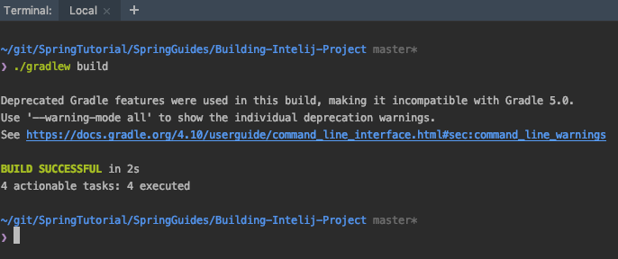
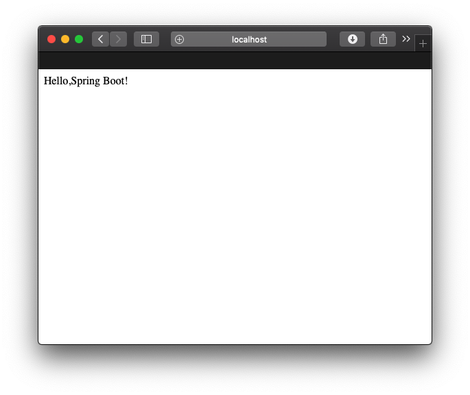

#Building Intelij Project

In this Tutorial  we make Java Spring Project build by Gradle in Intelij.

## Prerequisites

1. Intelij

2. Optionally Gradle(after make project also you can build this project by own your local gradle command)

3. Check you JVM version.(The version will be spacified in build.gradle file)

## Getting Started

Let's make Project and run Spring Web MVC. and get the "hello world" by RESTful Web

* Make Gradle Java Project in Intelij.

</img>

* Set Groupid and AritfactId

>> Groupid is project id. (etc. "com.companyname")
>> AritifactId is jar file name with out numbering.

</img>

* Modify build.gradle file

<pre>
buildscript {
    repositories {
        mavenCentral()
    }
    dependencies {
        classpath("org.springframework.boot:spring-boot-gradle-plugin:1.5.2.RELEASE")
    }
}

apply plugin: 'java'
apply plugin: 'eclipse'
apply plugin: 'idea'
apply plugin: 'org.springframework.boot'

jar {
    baseName = 'hellowworld'
    version =  '0.1.0'
}

repositories {
    mavenCentral()
}

sourceCompatibility = 11.0
targetCompatibility = 11.0

dependencies {
    compile("org.springframework.boot:spring-boot-starter-web")
    testCompile('org.springframework.boot:spring-boot-starter-test')
}

</pre>

* Make SpringBootAplication class

>> make Application.java ->(touch src/main/java/hello/Application.java)

<pre>
import org.springframework.boot.SpringApplication;
import org.springframework.boot.autoconfigure.SpringBootApplication;
import org.springframework.context.ApplicationContext;

@SpringBootApplication
public class Application {
    public static void main(String[] args) {
        ApplicationContext ctx = SpringApplication.run(Application.class, args);
    }
}
</pre>

`@SpringBootApplication` is a convenience annotation that adds all of the following:

- `@Configuration` tags the class as a source of bean definitions for the application context.
- `@EnableAutoConfiguration` tells Spring Boot to start adding beans based on classpath settings, other beans, and various property settings.
- Normally you would add `@EnableWebMvc` for a Spring MVC app, but Spring Boot adds it automatically when it sees **spring-webmvc** on the classpath. This flags the application as a web application and activates key behaviors such as setting up a `DispatcherServlet`.
- `@ComponentScan` tells Spring to look for other components, configurations, and services in the `hello` package, allowing it to find the controllers.

The `main()` method uses Spring Boot's `SpringApplication.run()` method to launch an application. Did you notice that there wasn't a single line of XML? No **web.xml** file either. This web application is 100% pure Java and you didn't have to deal with configuring any plumbing or infrastructure.

* Make Controller

>> make Controller.java ->(touch src/main/java/hello/Controller.java)

<pre>

package hello;

import org.springframework.web.bind.annotation.RequestMapping;
import org.springframework.web.bind.annotation.RestController;

@RestController
public class Controller {

    @RequestMapping("/")
    public String hello(){
        return "Hello,Spring Boot!";
    }
}

</pre>

The `@RequestMapping` annotation ensures that HTTP requests to `/greeting` are mapped to the `greeting()` method.

NOTE: The above example does not specify `GET` vs. `PUT`, `POST`, and so forth, because `@RequestMapping` maps all HTTP operations by default. Use `@RequestMapping(method=GET)` to narrow this mapping.

 

* Run Application using InteliJ and Gradle

Run Application in InteliJ

</img>

Build Project with gradlew cmd

<pre>
./gradlew build
</pre>

</img>

Run jar

<pre>
java -jar build/libs/helloworld-0.1.0.jar
</pre>

</img>

* Let's see result

>> open localhost:8080/

</img>
